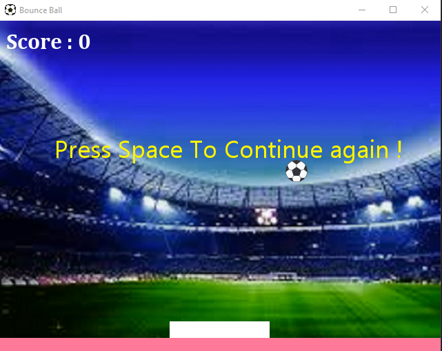

# Run the ` touchbounce.py ` file to play game
* just double click the file,the game window will open.don't need install any thing in your pc.
## Game Instructions : 
<ol>
<li>Press S or s to start game</li>
<li>Press SPACE to pause & unpause game</li>
<li>Press right arrow to move bar into right</li>
<li>Press left arrow to move bar into left</li>
<li>Press q or Esc to quit game from any state</li>
<li>When Ball Touch the white Bar increase point</li>
<li>When Ball Touch the Red Line Game Over</li>
<li>After Game over Press C or c to play agin'</li>
<li>Speed will increase after every 5 points</li>
</ol>

## Game Sample image

<!--  -->
* ` Game Instruciton `

* ` Continue Game `

* ` Pause Game `

* ` Game Over ` 

## Game Full video
[click here](sample/gameVideo.mp4)

